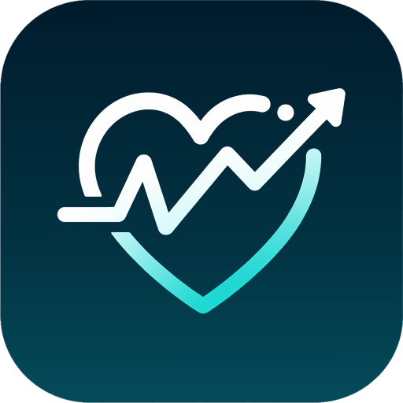
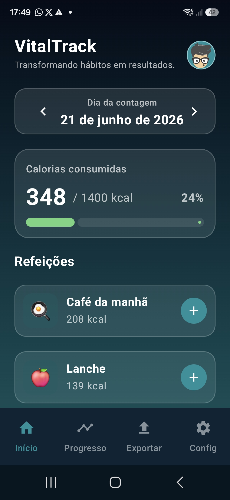
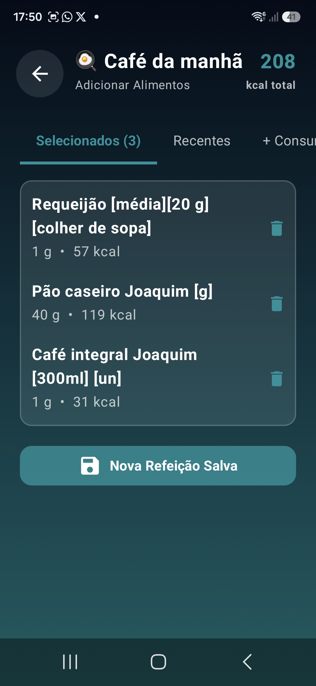
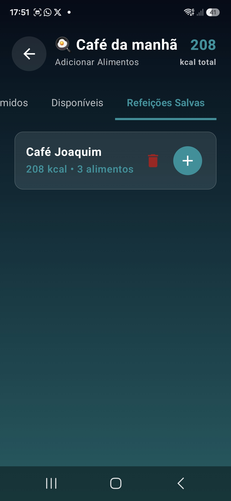
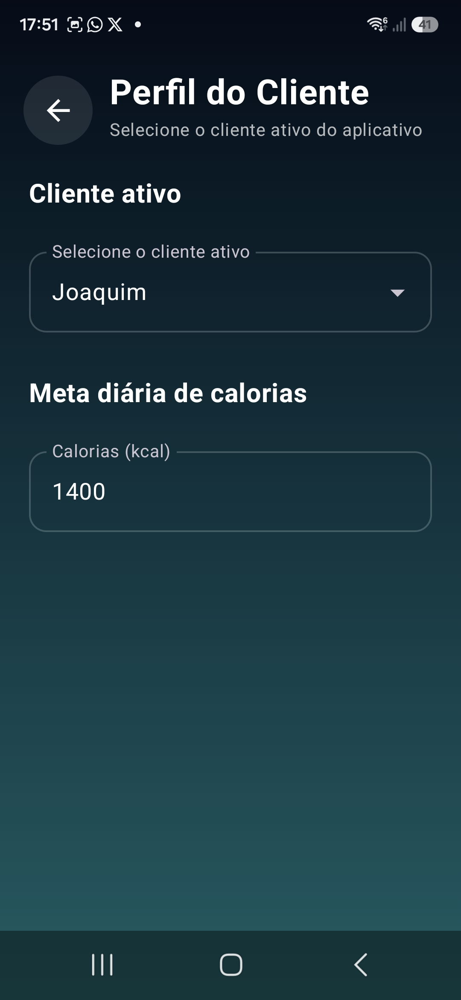
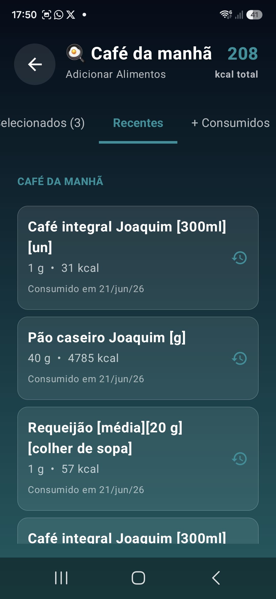
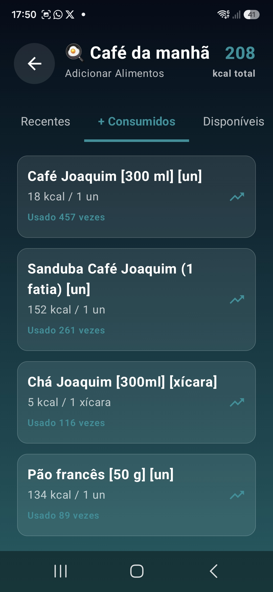
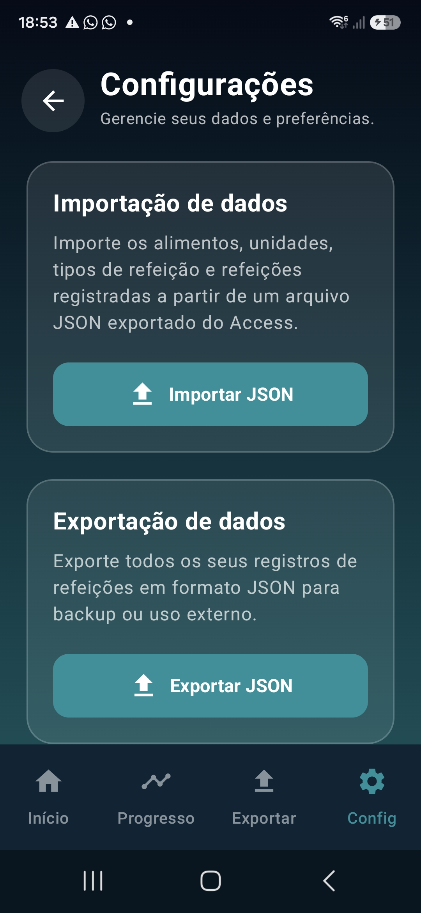

<h1>
  
  VitalTrack
</h1>

Aplicativo Android para monitoramento de alimentação, exercícios físicos, peso corporal e evolução da saúde, desenvolvido com **Kotlin** e **Jetpack Compose**.

O VitalTrack foi criado com foco na **eficiência do registro nutricional**, reduzindo ao máximo o tempo necessário para registrar refeições, acompanhar calorias, reutilizar alimentos recorrentes e manter o histórico alimentar organizado.

  

  

---

## Objetivo

Permitir o acompanhamento nutricional e físico de forma simples, rápida e eficiente, apoiando usuários em objetivos como:

* Emagrecimento
* Controle alimentar
* Hipertrofia
* Atividade física regular
* Ciclismo amador
* Acompanhamento de peso corporal
* Melhoria de hábitos de saúde

---

## Principais Recursos

* Registro rápido de refeições
* Controle de calorias consumidas vs. meta diária
* Cadastro e busca de alimentos
* Busca de alimentos ignorando acentuação
* Histórico de alimentos consumidos
* Alimentos consumidos recentemente
* Alimentos mais consumidos
* Refeições salvas e reutilizáveis
* Cópia de refeição anterior
* Registro de atividades físicas
* Acompanhamento de peso corporal
* Perfil de cliente ativo
* Meta calórica personalizada por usuário
* Importação de dados via JSON
* Exportação de dados para integração com MS Access

---

## Telas e Funcionalidades

### Dashboard

Tela inicial do aplicativo, funcionando como central de controle do usuário. 

Funcionalidades principais:

* Exibição dinâmica de calorias consumidas vs. meta diária
* Cards de refeições do dia
* Navegação entre datas anteriores e futuras
* Acesso rápido ao cadastro de refeições
* Acesso ao perfil do cliente por avatar personalizado
* Cards de refeição totalmente clicáveis para agilizar o uso

---

### Cadastro de Refeição

Tela otimizada para reduzir o tempo de digitação no registro alimentar.

A tela é organizada em abas:

1. **Selecionados**
   Exibe os alimentos já adicionados à refeição atual, permitindo edição de quantidade e remoção.

2. **Consumidos Recentemente**
   Lista alimentos utilizados nos últimos 30 dias.

3. **Mais Consumidos**
   Exibe os 50 alimentos mais frequentes no histórico do usuário.

4. **Alimentos**
   Busca global no banco de alimentos, com normalização de caracteres para ignorar acentos.

5. **Refeições Salvas**
   Permite reutilizar modelos completos de refeições.

Também há suporte à cópia da refeição anterior, permitindo repetir rapidamente o que foi consumido na mesma refeição em outro dia.

---

### Perfil do Cliente

Permite gerenciar o cliente ativo e suas preferências principais.

Funcionalidades:

* Seleção de cliente ativo por menu suspenso
* Meta calórica diária personalizada
* Persistência do cliente selecionado
* Persistência da meta calórica via Jetpack DataStore
* Suporte a múltiplos usuários no mesmo aplicativo

---

### Configurações e Gestão de Dados

Recursos voltados à importação, exportação e integração dos dados.

Funcionalidades:

* Importação de dados em formato JSON
* Exportação para arquivo `vitaltrack_export.json`
* Integração com sistemas externos, como MS Access
* Marcação de registros novos ou alterados para exportação
* Uso do Storage Access Framework do Android para escolha da pasta de destino

---

## Capturas de Tela

<table>
  <tr>
    <th>Dashboard</th>
    <th>Cadastro de Refeição</th>
    <th>Refeições Salvas</th>
    <th>Perfil do Cliente</th>
  </tr>
  <tr>
    <td align="center" width="25%">
      
       
      Tela inicial com resumo diário, meta calórica, refeições do dia e acesso rápido ao perfil do cliente.
    </td>
    <td align="center" width="25%">
      
       
      Fluxo inteligente para adicionar alimentos à refeição.
    </td>
    <td align="center" width="25%">
      
       
      Permite reutilizar modelos completos de refeições.
    </td>
    <td align="center" width="25%">
      
       
      Seleção do cliente ativo e definição da meta calórica diária.
    </td>
  </tr>
</table>

---

## Fluxo de Cadastro de Refeição

<table>
  <tr>
    <th>Selecionados</th>
    <th>Recentes</th>
    <th>Mais Consumidos</th>
  </tr>
  <tr>
    <td align="center" width="33%">
      
       
      Itens adicionados à refeição atual.
    </td>
    <td align="center" width="33%">
      
       
      Alimentos consumidos recentemente.
    </td>
    <td align="center" width="33%">
      
       
      Alimentos mais usados pelo cliente.
    </td>
  </tr>
</table>

---

<!--### Configurações e Gestão de Dados

Área dedicada à importação e exportação de dados, incluindo integração por JSON e compatibilidade com MS Access.

  

---  -->

## Banco de Dados e Arquitetura

O VitalTrack utiliza uma arquitetura local robusta, com foco em desempenho, persistência e organização dos dados.

Recursos técnicos:

* Room Database
* Banco de dados local com 9 tabelas interligadas
* Foreign Keys para integridade referencial
* Índices para melhoria de performance
* Migrations com controle de versão do banco
* Banco atualmente na versão 6
* DataStore para preferências e configurações de usuário
* Arquitetura MVVM
* Uso de StateFlow e Coroutines

---

## Tecnologias

* Kotlin
* Jetpack Compose
* Material Design 3
* Room Database
* Jetpack DataStore
* MVVM
* Coroutines
* StateFlow
* Storage Access Framework
* JSON

---

## Gamificação

A gamificação será adicionada ao VitalTrack para aumentar o engajamento, incentivar a consistência e transformar o acompanhamento diário em uma experiência mais motivadora.

### Recursos planejados

* Sistema de pontos por registros realizados
* Níveis de evolução do usuário
* Sequência de dias ativos
* Conquistas e medalhas
* Missões diárias
* Missões semanais
* Desafios pessoais
* Barras de progresso
* Recordes pessoais
* Calendário de consistência
* Resumo semanal com nota de desempenho
* Feedback positivo ao registrar refeições, treinos e peso

### Exemplos de conquistas

* Primeiro Registro
* Semana Consistente
* Mestre das Refeições
* Meta Batida
* Disciplina Semanal
* Ciclista em Ação
* Evolução Real
* Treino Registrado
* Refeição Completa

### Exemplos de missões diárias

* Registrar o peso do dia
* Registrar café da manhã, almoço e jantar
* Manter-se dentro da meta calórica
* Cadastrar um novo alimento
* Registrar um treino
* Revisar os totais consumidos do dia

### Exemplos de desafios

* Desafio 7 dias registrando refeições
* Desafio 30 dias acompanhando peso
* Desafio 4 semanas de treino
* Desafio 100 km de ciclismo no mês
* Desafio de consistência alimentar semanal

---

## Roadmap

| Status | Recurso                           |
| ------ | --------------------------------- |
| ✅      | Estrutura inicial do projeto      |
| ✅      | Cadastro de alimentos             |
| ✅      | Cadastro de refeições             |
| ✅      | Dashboard inicial                 |
| ✅      | Perfil do cliente                 |
| ✅      | Meta calórica personalizada       |
| ✅      | Importação JSON                   |
| ✅      | Exportação para MS Access         |
| ✅      | Busca sem acentuação              |
| ✅      | Consumidos recentemente           |
| ✅      | Mais consumidos                   |
| ✅      | Refeições salvas                  |
| ✅      | Cópia de refeição anterior        |
| ⏳      | Registro completo de treinos      |
| ⏳      | Acompanhamento avançado de peso   |
| ⏳      | Relatórios e gráficos de evolução |
| ⏳      | Gamificação                       |
| ⏳      | Metas nutricionais avançadas      |
| ⏳      | Integração com IA                 |
| ⏳      | Sincronização em nuvem            |

---

## Gamificação - Roadmap Técnico

A implementação da gamificação poderá ser realizada em fases.

### Fase 1 - Gamificação Simples

### Fase 2 - Missões e Desafios

### Fase 3 - Tela de Progresso

---

## Público-Alvo

O VitalTrack é voltado para usuários que desejam acompanhar sua evolução nutricional e física de forma prática.

Perfis atendidos:

* Pessoas em processo de emagrecimento
* Pessoas em controle alimentar
* Praticantes de musculação
* Atletas amadores
* Ciclistas
* Usuários que desejam melhorar hábitos alimentares
* Usuários que precisam de registro alimentar rápido e recorrente

---

## Ferramentas Utilizadas no Desenvolvimento

O desenvolvimento do VitalTrack contou com apoio de ferramentas de inteligência artificial e ambientes de desenvolvimento modernos.

* ChatGPT
* Google AI Studio com Gemini
* Android Studio com Gemini
* Gemini
* GitHub Copilot
* Android Studio

---

## Status

🚧 Em desenvolvimento ativo

O projeto encontra-se em evolução contínua, com foco inicial na consolidação do fluxo de registro alimentar, importação/exportação de dados e otimização da experiência do usuário.

---

## Licença

A definir.
